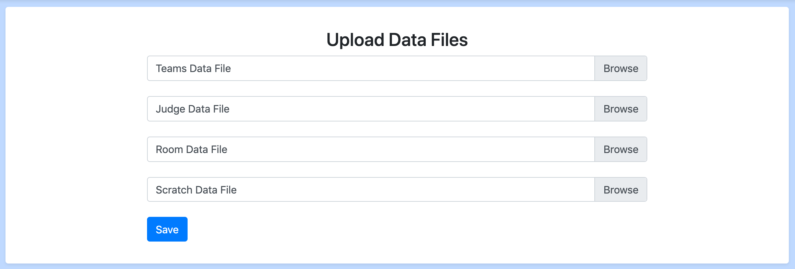

# Adding Teams, Judges, Rooms, and Debaters

There are two ways to enter teams, judges, rooms, and debaters:
[Manually entering individually](#manual-data-entry) or
[importing data in batches](#batch-data-import). In most cases, the batch
import is probably easier. However, you may need to enter data manually to add
one or two teams at a time, or to fix any errors that may have occurred when
importing data in bulk.

(batch-data-import)=
## Batch Data Import

To import data in bulk: First, navigate to the "File Data Upload" link under
the "Admin" section of the navigation menu:

Then, you should see a page where you can add a file for judges, rooms and teams:

You can upload xlsx files through this page to import data in bulk. When there is an
error in the format of the xlsx files, all changes generated from the file are aborted,
even if some were valid, so that you can simply re-upload a corrected version of the
file

You can use [these templates](https://drive.google.com/drive/folders/1ElIk0bM9uMpuewmOxb2e3-cWiLhCYv_5?usp=sharing)
for the teams, judges, and rooms files

### Judge spreadsheet columns

- Column A: Judge Name
- Column B: Judge Rank
- Columns C onward: Affiliated schools (one per column). Blank cells are ignored, so you can leave extra cells empty without creating phantom schools.
- The final *N* columns (where *N* is the value of the **Total Rounds** setting) represent the rounds you expect the judge to attend (`R1` through `RN`). Use `Y`, `Yes`, `True`, `1`, `X`, or `In` to mark a judge as expected for that round; leave the cell empty (or anything else) if they are not expected.

When the spreadsheet is imported, the expected-round columns populate the “Expected Judges” tab in batch check-in and the public judge list.

**NOTE:** The files _must_ be `.xlsx` files. Not `.xls`, `.csv`, or anything
similar

**NOTE:** All data in the first row will be ignored. That row is assumed to be
a header row.

(manual-data-entry)=
## Manual Data Entry

From the home page, you can add and view all _Schools, Judges, Teams, Debaters,
and Rooms_.  To enter information quickly, you should have multiple people
reading through your registration information and entering it into the program
at any given moment.

### Schools
1. Name - Name of the school, e.g. "Yale"

### Judges
1. Name - Name of the judge.
2. Rank - A number from 0.0 - 99.99 that represents the relative ranking of this
judge. Higher is a "better" judge.
3. Affiliated Schools - A list of schools that this judge should be unable to
judge. **Use this for team scratches as well as multiple affiliations**
4. Wing Only - Check this box if the judge can only serve as a wing judge and not as a chair. Wing-only judges will be excluded from automatic chair assignment during both in-rounds and outrounds. This is useful for ensuring that less experienced judges are never assigned as the chair of a panel.

**Note:** Judges automatically get assigned unique "ballot codes" (e.g., "wandering-tsunami", "icy-firefly") when created. These codes allow judges to submit e-ballots remotely. You can find a judge's ballot code:
- In the judge list view (appears in parentheses after the name)
- On the judge detail page
- Ballot codes can be used for online ballot submission Enter e-ballots from the mit-tab homepage under E-Ballots.

### Teams
1. Name - Name of the team, e.g. "Yale A"
2. School - School that this team should be protected from in pairing. If you
are entering a hybrid, select the team that has protection.
3. Hybrid school - For hybrids, the school they are not taking protection from.
This will prevent the team from being judged by this school, but not from
hitting teams from that school
4. Debaters - The debaters on this team, up to two debaters may be chosen and
you can add a debater directly (instead of having to enter them separately)
using the button to the right of the selection box.  If you select one debater
then the program will treat the team as an iron man team.
5. Seed - The seed of the team, used during the first round pairing.
6. Break Preference - Whether this team prefers to break varsity or novice.
This affects outround breaking if a novice team qualifies for the varsity break.
7. Checked in - If this box is checked then any rounds you pair will include
this team in the pairing. Uncheck this if you want the team to not be paired
into the rounds.
8. Scratch Count - Used for generating a form that allows you to immediately
add scratches.  Feel free to put zero and add scratches later (they can be
added from either the judge page or the team page at any time).

**Note:** Teams automatically get assigned unique "team codes" (fun names like
"Icy Firefly" or "Wandering Tsunami") that can be used for anonymous display on public views if
enabled in settings. These codes are automatically generated and are unique to each team.

### Debaters
1. Name - Name of the debater, e.g. "Matt Smith".
2. Novice status - Varsity or novice, used by the program to determine novice
team/debater rankings.

### Rooms
1. Name - Name of the room.
2. Rank -  A number from 0.0 - 99.99 that represents the relative ranking of
this room.  Higher is a "better" room, and higher ranked rooms will be paired
in before other rooms.
