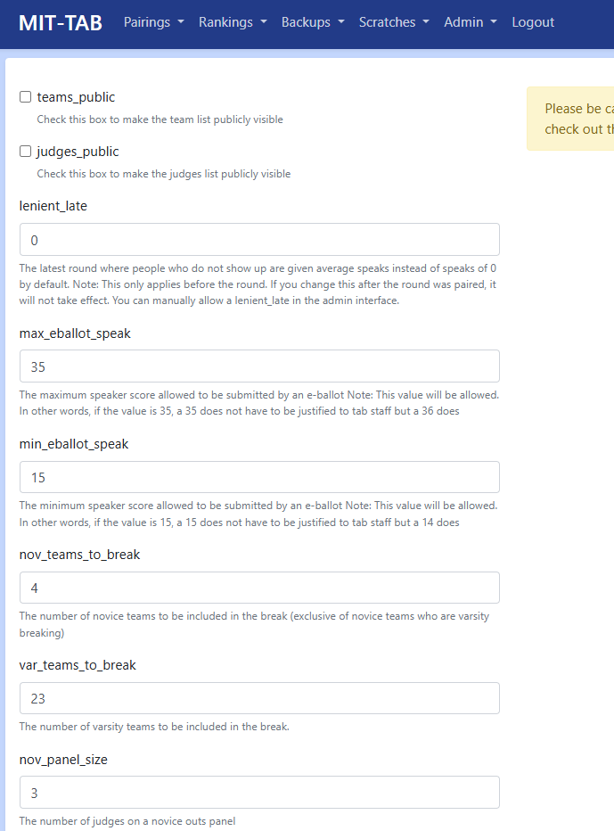

# Advanced Topics

MIT-Tab's TabSetting module allows tournaments to modify the internal logic of
how mit-tab works. This article will document ways that you can use tab settings
to improve your tournament.

## Modifying Tab Settings

The primary way to modify tab settings is through the **Settings Form** (accessible via Admin > Settings in the navigation menu). This form provides a user-friendly interface with descriptions for each setting, input validation, and organized sections.



To use the settings form:
1. Navigate to Admin > Settings in the navigation menu
2. Locate the setting you want to modify in the organized sections
3. Read the description to understand what the setting controls
4. Enter your desired value
5. Click "Save Settings"

The form will validate your input and prevent errors or invalid values.

### Advanced: Using the Admin Interface

For advanced use cases or settings not yet available in the form, you can use the raw admin interface. Navigate to the admin interface in the navigation menu ("Admin" > "Admin Interface"), then click the "Tab settings" link.


You should now be on a page with the heading "Select tab settings to change" that looks like this:


To edit a tab setting, click on it and change the "value" attribute. To create a new tab setting, click the "Add tab settings" button in the top right corner. The "key" should be the (case-sensitive) name of the setting, and the "value" should be the desired value for the setting. Be careful with spelling and values when using this interface.

## Default Tab Settings

Below is a reference table of available settings. Most can be modified through the settings form; a few advanced settings may require using the admin interface.

```{eval-rst}
+--------------------------+---------------+------------------------------------------------------------------------------------------------------------------------------------------------------------------------------------------------------------------------------------------------------------------------------------------------------------------------------------------------------------------------+
| Name                     | Default value | Purpose                                                                                                                                                                                                                                                                                                                                                                |
+==========================+===============+========================================================================================================================================================================================================================================================================================================================================================================+
| `cur_round`              | `1`           | Control the current round of the tournament. **Don't modify this**                                                                                                                                                                                                                                                                                                     |
+--------------------------+---------------+------------------------------------------------------------------------------------------------------------------------------------------------------------------------------------------------------------------------------------------------------------------------------------------------------------------------------------------------------------------------+
| `tot_rounds`             | `5`           | Number of in-rounds at the tournament                                                                                                                                                                                                                                                                                                                                  |
+--------------------------+---------------+------------------------------------------------------------------------------------------------------------------------------------------------------------------------------------------------------------------------------------------------------------------------------------------------------------------------------------------------------------------------+
| `min_speak`              | `0`           | The minimum speaker score allowed to be submitted by the tab staff                                                                                                                                                                                                                                                                                                     |
+--------------------------+---------------+------------------------------------------------------------------------------------------------------------------------------------------------------------------------------------------------------------------------------------------------------------------------------------------------------------------------------------------------------------------------+
| `max_speak`              | `50`          | The maximum speaker score allowed to be submitted by the tab staff                                                                                                                                                                                                                                                                                                     |
+--------------------------+---------------+------------------------------------------------------------------------------------------------------------------------------------------------------------------------------------------------------------------------------------------------------------------------------------------------------------------------------------------------------------------------+
| `max_eballot_speak`      | `35`          | The maximum speaker score allowed to be submitted by an e-ballot Note: This value will be allowed. In other words, if the value is `35`, a 35 does not have to be justified to tab staff but a 36 does                                                                                                                                                                 |
+--------------------------+---------------+------------------------------------------------------------------------------------------------------------------------------------------------------------------------------------------------------------------------------------------------------------------------------------------------------------------------------------------------------------------------+
| `min_eballot_speak`      | `15`          | The minimum speaker score allowed to be submitted by an e-ballot Note: This value will be allowed. In other words, if the value is `15`, a 15 does not have to be justified to tab staff but a 14 does                                                                                                                                                                 |
+--------------------------+---------------+------------------------------------------------------------------------------------------------------------------------------------------------------------------------------------------------------------------------------------------------------------------------------------------------------------------------------------------------------------------------+
| `lenient_late`           | `0`           | The latest round where people who do not show up are given average speaks instead of speaks of 0 by default. Note: This only applies _before_ the round. If you change this after the round was paired, it will not take effect. You can manually allow a lenient_late in the admin interface. Docs coming soon.                                                       |
+--------------------------+---------------+------------------------------------------------------------------------------------------------------------------------------------------------------------------------------------------------------------------------------------------------------------------------------------------------------------------------------------------------------------------------+
| `pairing_released`       | `0`           | Check this to make pairings publicly visible, uncheck when they are not                                                                                                                                                                                                                                                                                                |
+--------------------------+---------------+------------------------------------------------------------------------------------------------------------------------------------------------------------------------------------------------------------------------------------------------------------------------------------------------------------------------------------------------------------------------+
| `results_published`      | `0`           | Check this to make tournament results publicly visible. Can be toggled via the Admin menu.                                                                                                                                                                                                                                                                             |
+--------------------------+---------------+------------------------------------------------------------------------------------------------------------------------------------------------------------------------------------------------------------------------------------------------------------------------------------------------------------------------------------------------------------------------+
| `fair_bye`               | `1`           | Check this if only unseeded teams should be eligible for a first round bye, uncheck if all teams should be eligible                                                                                                                                                                                                                                                    |
+--------------------------+---------------+------------------------------------------------------------------------------------------------------------------------------------------------------------------------------------------------------------------------------------------------------------------------------------------------------------------------------------------------------------------------+
| `use_team_codes`         | `0`           | Check this to display team codes on the public pairings view, uncheck to display normal team names                                                                                                                                                                                                                                                                     |
+--------------------------+---------------+------------------------------------------------------------------------------------------------------------------------------------------------------------------------------------------------------------------------------------------------------------------------------------------------------------------------------------------------------------------------+
| `teams_public`           | `0`           | Check this to make the teams list publicly visible                                                                                                                                                                                                                                                                                                                     |
+--------------------------+---------------+------------------------------------------------------------------------------------------------------------------------------------------------------------------------------------------------------------------------------------------------------------------------------------------------------------------------------------------------------------------------+
| `judges_public`          | `0`           | Check this to make the judges list publicly visible                                                                                                                                                                                                                                                                                                                    |
+--------------------------+---------------+------------------------------------------------------------------------------------------------------------------------------------------------------------------------------------------------------------------------------------------------------------------------------------------------------------------------------------------------------------------------+
| `debaters_public`        | `1`           | Check this to make debaters publicly visible on the public teams list                                                                                                                                                                                                                                                                                                  |
+--------------------------+---------------+------------------------------------------------------------------------------------------------------------------------------------------------------------------------------------------------------------------------------------------------------------------------------------------------------------------------------------------------------------------------+
| `team_codes_backend`     | `0`           | Check this to use team codes for all non-public views                                                                                                                                                                                                                                                                                                                  |
+--------------------------+---------------+------------------------------------------------------------------------------------------------------------------------------------------------------------------------------------------------------------------------------------------------------------------------------------------------------------------------------------------------------------------------+
| `nov_teams_to_break`     | `4`           | The number of novice teams to be included in the break (exclusive of novice teams who are varsity breaking)                                                                                                                                                                                                                                                            |
+--------------------------+---------------+------------------------------------------------------------------------------------------------------------------------------------------------------------------------------------------------------------------------------------------------------------------------------------------------------------------------------------------------------------------------+
| `var_teams_to_break`     | `8`           | The number of varsity teams to be included in the break.                                                                                                                                                                                                                                                                                                               |
+--------------------------+---------------+------------------------------------------------------------------------------------------------------------------------------------------------------------------------------------------------------------------------------------------------------------------------------------------------------------------------------------------------------------------------+
| `nov_panel_size`         | `3`           | The number of judges on a novice outs panel.                                                                                                                                                                                                                                                                                                                           |
+--------------------------+---------------+------------------------------------------------------------------------------------------------------------------------------------------------------------------------------------------------------------------------------------------------------------------------------------------------------------------------------------------------------------------------+
| `var_panel_size`         | `3`           | The number of judges on a varsity outs panel.                                                                                                                                                                                                                                                                                                                          |
+--------------------------+---------------+------------------------------------------------------------------------------------------------------------------------------------------------------------------------------------------------------------------------------------------------------------------------------------------------------------------------------------------------------------------------+
| `var_to_nov`             | `2`           | The offset of the novice break to the varsity break.  If novice semis happen when varsity quarters happen, the offset should be 1.  If novice semis happen when varsity octofinals happen, the offset should be 2.                                                                                                                                                     |
+--------------------------+---------------+------------------------------------------------------------------------------------------------------------------------------------------------------------------------------------------------------------------------------------------------------------------------------------------------------------------------------------------------------------------------+
| `var_teams_visible`      | `256`         | The number of teams above which the varsity outround is visible.  For example, if it were 8, quarterfinals and above would be visible, if it were 4, semifinals and above would be visible.                                                                                                                                                                            |
+--------------------------+---------------+------------------------------------------------------------------------------------------------------------------------------------------------------------------------------------------------------------------------------------------------------------------------------------------------------------------------------------------------------------------------+
| `nov_teams_visible`      | `256`         | The number of teams above which the novice outround is visible.  For example, if it were 8, quarterfinals and above would be visible, if it were 4, semifinals and above would be visible.                                                                                                                                                                             |
+--------------------------+---------------+------------------------------------------------------------------------------------------------------------------------------------------------------------------------------------------------------------------------------------------------------------------------------------------------------------------------------------------------------------------------+
| `gov_opp_display`        | `0`           | A toggle to switch the outrounds view from displaying Gov and Opp (when checked) and Team 1 and Team 2 (when value is 2)                                                                                                                                                                                                                                               |
+--------------------------+---------------+------------------------------------------------------------------------------------------------------------------------------------------------------------------------------------------------------------------------------------------------------------------------------------------------------------------------------------------------------------------------+
| `sidelock`               | `0`           | Check this to indicate you are side-locking outrounds. When checked, the gov opps for outrounds will not be random, but will adhere to sidelocks, and will be indicated on the pairing card, and bolded on the front-facing pairing display.                                                                                                                           |
+--------------------------+---------------+------------------------------------------------------------------------------------------------------------------------------------------------------------------------------------------------------------------------------------------------------------------------------------------------------------------------------------------------------------------------+
| `choice`                 | `0`           | Check this to display who has choice, whether you would like this to be indicated on the pairing card, and bolded on the front-facing pairing display.                                                                                                                                                                                                                 |
+--------------------------+---------------+------------------------------------------------------------------------------------------------------------------------------------------------------------------------------------------------------------------------------------------------------------------------------------------------------------------------------------------------------------------------+
| `enable_room_seeding`    | `1`           | Toggle to enable room seeding. When enabled, the best rooms go to the highest seeded rounds (best speaking teams).                                                                                                                                                                                                                                                     |
+--------------------------+---------------+------------------------------------------------------------------------------------------------------------------------------------------------------------------------------------------------------------------------------------------------------------------------------------------------------------------------------------------------------------------------+
| `show_outrounds_bracket` | `0`           | Toggle to display the bracket view for outrounds. When enabled, users can switch between list view and bracket view for outround pairings on the outround pairing page.                                                                                                                                                                                                |
+--------------------------+---------------+------------------------------------------------------------------------------------------------------------------------------------------------------------------------------------------------------------------------------------------------------------------------------------------------------------------------------------------------------------------------+
| `allow_rejudges`         | `0`           | Toggle to indicate whether or not rejudges are allowed. When unchecked (default), the system will avoid assigning judges to teams they've judged before. When checked, rejudges are allowed but still minimized by the assignment algorithm. The UI will always show a warning badge when a judge has seen a team before.                                              |
+--------------------------+---------------+------------------------------------------------------------------------------------------------------------------------------------------------------------------------------------------------------------------------------------------------------------------------------------------------------------------------------------------------------------------------+
```

## Running a Tournament with a Non-Standard number of rounds

To run a tournament that has more/less than 5 rounds, change the value of the
`tot_rounds` setting to the number of rounds using the settings form. If you don't do this, the
gov/opp count optimization will not work, and pairings may get messed up.

## Dropping a Team with Average Speaks

By default, when teams forfeit, they are given speaks of 0 and ranks of 7.
To override this behavior, set the `lenient_late` tab setting to the last round number 
where forfeits should default to average speaks. For example, setting it to `1` would
default any forfeits in round 1 to use average speaks. Setting it to `4` would
make it the default behavior for rounds 1-4.

To override the default behavior for a specific team in a specific round, navigate to the admin
interface and click on the "No shows" link. You will now see a list of links
formatted as `{Team name} was a no-show for round {round number}`. Find the
team and round that you want to override, check/uncheck the "lenient late"
option, and click "save".

(modifying-the-pairing-algorithm)=
## Modifying the Pairing Algorithm

The pairing algorithm uses creates minimum weight maximal matching algorithm to
create the round. You can read more about the algorithm used
[here](https://www.wikiwand.com/en/articles/Blossom_algorithm?upgrade=true). What this means is that
the pairing algorithm isn't a list of specific rules. Instead, it generates
every possible pairing for the round, gives a score to each pairing, and then
selects the pairings with the highest score. Penalties with the highest
magnitude are the "worst" penalties. Those with values closer to 0 are less
significant.

Most pairing-related settings can be adjusted through the settings form. The value of each penalty setting
must be negative or zero. Positive values will produce incorrect pairings.

Here are the settings you can create, along with their default values:

```{eval-rst}
+--------------------------+---------------+------------------------------------------------------------------------------------------------------------------------------------------------------------+
| Tab setting name         | Default value | Description                                                                                                                                                |
+==========================+===============+============================================================================================================================================================+
| `power_pairing_multiple` | `-1`          | For each position that the pairing is shifted from the "ideal" power-pairing, it's multiplied by this number                                               |
+--------------------------+---------------+------------------------------------------------------------------------------------------------------------------------------------------------------------+
| `high_opp_penalty`       | `0`           | One team will have to opp more than `half of the rounds + 1` (e.g. 4 opps at a 5 round tournament)                                                         |
+--------------------------+---------------+------------------------------------------------------------------------------------------------------------------------------------------------------------+
| `high_gov_penalty`       | `-100`        | One team will have to gov more than `half of the rounds + 1` (e.g. 4 govs at a 5 round tournament)                                                         |
+--------------------------+---------------+------------------------------------------------------------------------------------------------------------------------------------------------------------+
| `higher_opp_penalty`     | `-10`         | One team will have to opp more than `half of the rounds + 2` (e.g. 5 opps at a 5 round tournament)                                                         |
+--------------------------+---------------+------------------------------------------------------------------------------------------------------------------------------------------------------------+
| `same_school_penalty`    | `-1000`       | Both teams are taking protection from the same school                                                                                                      |
+--------------------------+---------------+------------------------------------------------------------------------------------------------------------------------------------------------------------+
| `hit_pull_up_before`     | `-10000`      | A team who has hit the pull-up already will hit the pull-up again. (Note: Teams that have already been pulled up will never be considered for the pull-up) |
+--------------------------+---------------+------------------------------------------------------------------------------------------------------------------------------------------------------------+
| `hit_team_before`        | `-100000`     | The two teams in the pairing have already debated each other                                                                                               |
+--------------------------+---------------+------------------------------------------------------------------------------------------------------------------------------------------------------------+
```

So, if you wanted to change the penalties so that having 4 govs was half as
important as it usually is, you could change the value of `high_gov_penalty` to
`-50` using the settings form. If you wanted to make it not considered at all, you could change it to `0`.

To prevent seeded teams from getting the bye, check `fair_bye` in the settings form.