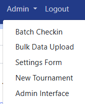
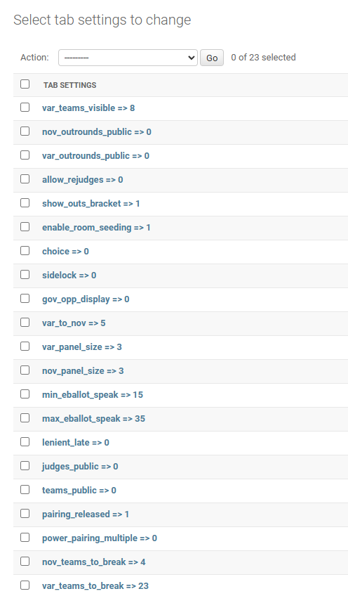

Advanced Topics
===============

MIT-Tab's TabSetting module allows tournaments to modify the internal logic of
how mit-tab works. This article will document ways that you can use tab settings
to improve your tournament.

For each of the modifications below, you will have to know how to create or
modify a tab setting. In order to do that, first, navigate to the admin
interface in the navigation menu ("Admin" > "Admin Interface")



You will then be taken to a page titled "Site administration". On that page,
click the "Tab settings" link. You should now be on a page with the heading
"Select tab settings to change" that looks like this:



Modifying a Tab Setting
-----------------------

To edit a tab setting, click on the one that you want to modify and change the
"value" attribute

Creating a Tab Setting
----------------------

To create a tab setting, click the "Add tab settings" button in the top right
corner of the page. The "key" should be the (case-sensitive) name of the
setting, and the "value" should be the desired value for the setting

Default Tab Settings
--------------------

Here are the default `TabSettings` unrelated to the power-pairing calculations
(those related to that can be seen at the bottom of this page.)

Note: Some may already exist on your server, some may not. The code will use
these settings if provided regardless of if it showed up in the interface before
you created it

```eval_rst
+---------------------+---------------+------------------------------------------------------------------------------------------------------------------------------------------------------------------------------------------------------------------------------------------------------------------------------------------------------------------+
| Name                | Default value | Purpose                                                                                                                                                                                                                                                                                                          |
+=====================+===============+==================================================================================================================================================================================================================================================================================================================+
| `cur_round`         | `1`           | Control the current round of the tournament. **Don't modify this**                                                                                                                                                                                                                                               |
+---------------------+---------------+------------------------------------------------------------------------------------------------------------------------------------------------------------------------------------------------------------------------------------------------------------------------------------------------------------------+
| `tot_rounds`        | `5`           | Number of in-rounds at the tournament                                                                                                                                                                                                                                                                            |
+---------------------+---------------+------------------------------------------------------------------------------------------------------------------------------------------------------------------------------------------------------------------------------------------------------------------------------------------------------------------+
| `min_speak`         | `0`           | The minimum speaker score allowed to be submitted by the tab staff                                                                                                                                                                                                                                               |
+---------------------+---------------+------------------------------------------------------------------------------------------------------------------------------------------------------------------------------------------------------------------------------------------------------------------------------------------------------------------+
| `max_speak`         | `50`          | The maximum speaker score allowed to be submitted by the tab staff                                                                                                                                                                                                                                               |
+---------------------+---------------+------------------------------------------------------------------------------------------------------------------------------------------------------------------------------------------------------------------------------------------------------------------------------------------------------------------+
| `max_eballot_speak` | `35`          | The maximum speaker score allowed to be submitted by an e-ballot Note: This value will be allowed. In other words, if the value is `35`, a 35 does not have to be justified to tab staff but a 36 does                                                                                                           |
+---------------------+---------------+------------------------------------------------------------------------------------------------------------------------------------------------------------------------------------------------------------------------------------------------------------------------------------------------------------------+
| `min_eballot_speak` | `15`          | The minimum speaker score allowed to be submitted by an e-ballot Note: This value will be allowed. In other words, if the value is `15`, a 15 does not have to be justified to tab staff but a 14 does                                                                                                           |
+---------------------+---------------+------------------------------------------------------------------------------------------------------------------------------------------------------------------------------------------------------------------------------------------------------------------------------------------------------------------+
| `lenient_late`      | `0`           | The latest round where people who do not show up are given average speaks instead of speaks of 0 by default. Note: This only applies _before_ the round. If you change this after the round was paired, it will not take effect. You can manually allow a lenient_late in the admin interface. Docs coming soon. |
+---------------------+---------------+------------------------------------------------------------------------------------------------------------------------------------------------------------------------------------------------------------------------------------------------------------------------------------------------------------------+
| `pairing_released`  | `0`           | `1` if the pairings are publicly visible, `0` when they are not                                                                                                                                                                                                                                                  |
+---------------------+---------------+------------------------------------------------------------------------------------------------------------------------------------------------------------------------------------------------------------------------------------------------------------------------------------------------------------------+
| `fair_bye`          | `1`           | `1` if only unseeded teams should be eligible for a first round bye, `0` if all teams should be eligible                                                                                                                                                                                                         |
+---------------------+---------------+------------------------------------------------------------------------------------------------------------------------------------------------------------------------------------------------------------------------------------------------------------------------------------------------------------------+
```

Running a Tournament with a Non-Standard number of rounds
---------------------------------------------------------

To run a tournament that has more/less than 5 round, change the value of the
`tot_rounds` setting to the number of rounds. If you don't do this, the
gov/opp count optimization will not work, and pairings may get messed up.

Dropping a Team with Average Speaks
-----------------------------------

By default, when teams forfeit, they are given speaks of 0 and ranks of 7.
To override this behavior, create a tab_setting with the key `lenient_late`.
The value of the tab setting is the last round number where the default
behavior of a forfeit is average speaks. For example, setting it to `1` would
default any forfeits in round 1 to use average speaks. Setting it to `4` would
make it the default behavior for rounds 1-4.

To override the default behavior for the round, navigate to the admin
interface and click on the "No shows" link. You will now see a list of links
formatted as `{Team name} was a no-show for round {round number}`. Find the
team and round that you want to override, check/uncheck the "lenient late"
option, and click "save".

Modifying the Pairing Algorithm
-------------------------------

The pairing algorithm uses creates minimum weight maximal matching algorithm to
create the round. You can read more about the algorithm used
[here](https://www.wikiwand.com/en/Blossom_algorithm). What this means is that
the pairing algorithm isn't a list of specific rules. Instead, it generates
every possible pairing for the round, gives a score to each pairing, and then
selected the pairings with the highest score. Penalties with the highest
magnitude are the "worst" penalties. Those with values closer to 0 are less
significant.

**Note**: The value of the setting _must_ be negative. Otherwise your pairings
will be very bad.

Here are the settings you can create, along with their default values:

```eval_rst
+--------------------------+---------------+------------------------------------------------------------------------------------------------------------------------------------------------------------+
| Tab setting name         | Default value | Description                                                                                                                                                |
+==========================+===============+============================================================================================================================================================+
| `power_pairing_multiple` | `-1`          | For each position that the pairing is shifted from the "ideal" power-pairing, it's multiplied by this number                                               |
+--------------------------+---------------+------------------------------------------------------------------------------------------------------------------------------------------------------------+
| `high_opp_penalty`       | `0`           | One team will have to opp more than `half of the rounds + 1` (e.g. 4 opps at a 5 round tournament)                                                         |
+--------------------------+---------------+------------------------------------------------------------------------------------------------------------------------------------------------------------+
| `high_gov_penalty`       | `-100`        | One team will have to gov more than `half of the rounds + 1` (e.g. 4 govs at a 5 round tournament)                                                         |
+--------------------------+---------------+------------------------------------------------------------------------------------------------------------------------------------------------------------+
| `higher_opp_penalty`     | `-10`         | One team will have to opp more than `half of the rounds + 2` (e.g. 5 opps at a 5 round tournament)                                                         |
+--------------------------+---------------+------------------------------------------------------------------------------------------------------------------------------------------------------------+
| `same_school_penalty`    | `-1000`       | Both teams are taking protection from the same school                                                                                                      |
+--------------------------+---------------+------------------------------------------------------------------------------------------------------------------------------------------------------------+
| `hit_pull_up_before`     | `-10000`      | A team who has hit the pull-up already will hit the pull-up again. (Note: Teams that have already been pulled up will never be considered for the pull-up) |
+--------------------------+---------------+------------------------------------------------------------------------------------------------------------------------------------------------------------+
| `hit_team_before`        | `-100000`     | The two teams in the pairing have already debated each other                                                                                               |
+--------------------------+---------------+------------------------------------------------------------------------------------------------------------------------------------------------------------+
```

So, if I wanted to change the penalties so that having 4 govs was half as
important as it usually is, I'd change the value of `high_gov_penalty` to
`-50`. If I wanted to make it not considered at all, I'd change it to `0`.

If you would like to prevent seeded teams from getting the bye, set
`fair_bye` to `1`
