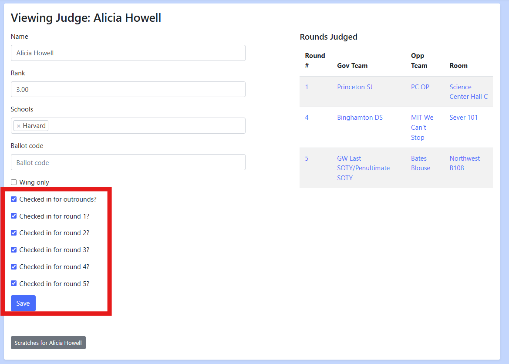

Before Round 1
==============

Before Round 1 on your tournament day you need to enter scratches as teams
check in, check in judges and teams, adjust registration as needed, and pair the
first round.  All of this can be done very quickly if you split up the tasks and
have multiple people working on them (i.e. multiple people entering scratches).

Entering Scratches
------------------

School Scratch: Navigate to the judge page in question, and then add an
affiliation with the school you would like them to be scratched from.
Whenever you pair a round the scratches will be automatically generated and you
will be able to view them from the scratch view. Do not worry if they don't
show up in the scratches view prior to pairing.

Discretionary Scratch: Navigate to either the judge page or team page,
click on the "Scratches for <Name>" button at the bottom of the page.
Then click the "Add Scratch" button.  This workflow for judges is shown below:

First click "Scratches for _Name_"

Then click "Add Scratch" at the bottom of the page

Judge/Team Check Ins
--------------------

For judges, you should check them in for the rounds that they can judge during.
Some tab staffs like to make judges check in every round, others take them down
at the start.  Either way, the judge will only be paired into the round if they
are checked into the round.

The easiest way to check-in judges is via the batch check-in page ("Admin >
Batch Judge Check In"), pictured below:

Alternatively, you can check a judge in individually on the page for that
specific judge:

Unlike judges you cannot check a team into certain rounds but not others ahead
of time. Every time you pair a round, teams that are "Checked in" will be paired
in and any that are not "Checked in" will be given a "No Show" loss. For the
purposes of tabbing this is a loss, with both speakers receiving 0s for speaks
and ranks of 7.  If you want to give a team that you had checked out a Bye
because they should have been checked in, give them a Bye via the admin
interface and **remove the No Show** loss.

Pairing the First Round
-----------------------

To pair the first round, click "Prepare Next Pairing", check that all of the
sanity checks are green, and click "Pair This Round".  While the program is
pairing you should do absolutely nothing.  Do not add teams, do not navigate
away, etc ... Depending on the size of your tournament it will take anywhere
from 10 seconds to a minute and a half.
