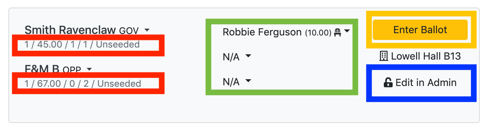

# Running a Tournament

This document will cover anything you need to do after all the teams, judges,
and rooms are registered and checked in.

For each round after round 1, you need to enter results, make sure you have
enough judges, and pair the next round. **Having multiple people logged in and
entering result information and checking that information makes your tournament
run significantly better (faster and more accurate).** It is **highly**
advised that you do this.

## Entering Results

After pairing a round, you will mostly be dealing with the current round's
pairing view located at `/pairings/status/`. This is kind of the control center
for the whole tournament, and you can change pretty much anything from this
view.  The areas of importance are shown below:

* Red: This area shows you basic information about the government and
  opposition teams.  Use this to quickly check if the pairings make sense.
* Green: This area shows the judge(s) assigned to a round. In the case of a
  panel, the chair is the one with the highest rank, not necessarily the one at
  the top. Click the "NA" button to select panelists
* Yellow: This is where you click to enter results for that round. Note that
  whenever entering forfeit wins or losses, enter speaks **of zero** and assign
  ranks arbitrarily.  The program will do the right thing. Possible results are
  1. Gov/Opp win: The government or opposition team won outright, this is 99%
     of results.
  2. Gov/Opp win via forfeit: The government or opposition team won via a
     forfeit, e.g. their opponents did not show up. The winning team will get
     average speaks and ranks for the round and the losing team will get
     speaks of zero and ranks of 7.  You can manually assign the losing team
     speaks greater than zero if you don't want to totally tank their speaks,
     but they will continue to get ranks of 7 (this is potentially changing
     going forwards).
  3. All Drop: Both teams lose the round. Everyone gets speaks of zero and
     ranks of 7.  Use this for when both teams don't show up.
  4. All Win: Both teams win the round.  Useful for when a judge does not show
     up to a round and you don't want the tournament to run behind. Both teams
     get average speaks and ranks for that round (recalculated with every
     round).
* Blue: This is where you click to edit the round in the administration
  interface.  From that interface you can change anything you want about the
  round, e.g. which teams are debating, which judge is judging, which room the
  debate is in, etc ...  Note that you can also drag and drop judges around as
  well as teams from the pairing view, but only within the pairing (i.e. you
  can't drag a judge that wasn't paired in into the pairing, you can make this
  change from the admin interface, however). Alternatively, you can use the
  "Alternative Judges", "Alternative Teams", or "Alternative Rooms" buttons to
  swap judges, teams, or rooms without entering the admin interface. Please do
  not delete rounds unless you also delete the corresponding Round Stats
  (viewable from the admin interface) for the debaters in that round.  You
  really should not need to ever delete a round, the various options for the
  results of a round should be sufficient.

## E-Ballots

MIT-Tab supports electronic ballot submission (e-ballots) for judges. Each judge
has a unique ballot code that is automatically generated when they are created. This code
can be found on the judge list view and in the judge detail page.

To use e-ballots:
1. Ensure pairings are released (see "Releasing Pairings" below)
2. Judges can access the e-ballot interface at `/e_ballots/` and enter their unique ballot code
3. Only the chair of a panel can submit e-ballot results
4. E-ballots have configurable minimum and maximum speaker score limits (see Advanced Topics)
   - Default minimum: 15 (configurable via `min_eballot_speak` setting)
   - Default maximum: 35 (configurable via `max_eballot_speak` setting)
   - Scores outside these bounds require justification to tab staff

This is particularly useful for:
- Remote judging
- Reducing paper usage
- Faster result submission
- Minimizing data entry errors

### Tracking Missing Ballots

To see which rounds are still missing results, navigate to `/pairings/missing_ballots/`.
This page shows all rounds that don't have results entered yet, helping you
track down missing ballots quickly. This is especially useful when you're ready to pair
the next round but waiting on a few stragglers.

## Missing Ballots

To see which rounds are still missing results, navigate to `/pairings/missing_ballots/`.
This page shows all rounds that don't have results entered yet, helping you
track down missing ballots quickly.

## Viewing Team Statistics

MIT-Tab provides detailed statistics and records for each team:

### Team Detail View
When you click on a team from the teams list, you'll see:
- Total wins
- Total speaker points
- Number of times on gov/opp
- Average opposition wins (opposition strength)
- Number of times pulled up
- Number of times hitting the pull-up
- Links to view the team's tab card

### Tab Cards
Each team has a "tab card" that shows their complete tournament record:
- **Individual Tab Card**: View at `/team/card/<team_id>/pretty/` or click "View Tab Card" from team detail
- **All Tab Cards**: View all team tab cards at once at `/team/all_tab_cards/` (useful for printing)

Tab cards display:
- Round-by-round results (W/L)
- Gov/Opp sides for each round
- Individual debater speaks and ranks for each round
- Opponents faced in each round
- Judges assigned to each round
- Current tournament statistics and standings

(pairing-the-next-round)=
## Pairing the Next Round

To pair a round, navigate to `/pairings/status/` and hit "Prepare Next Round".
For any round after round 1, make sure that all results have been entered.
After that, you should see this page:

This signals that it is safe to pair the round. Backups before and after the
pairing will automatically be created for you and labeled with the round number
in case you need to restore from backups due to a pairing error.

After pairing, you have several options:

### Assigning Judges

Hit the "Assign Judges" button to automatically pair judges into the rounds. The automatic
assignment algorithm:
- Assigns the highest-ranked judges to the highest-seeded (best speaking) rounds
- Respects all scratches (both tab and team scratches)
- Avoids rejudging when possible (teams seeing the same judge again)
- **Excludes wing-only judges from chair positions** (they can still be assigned as panel members)
- Uses a maximum weight matching algorithm for optimal assignments

**Manual Judge Assignment**: You can also manually assign or swap judges:
- Click on any judge name in the pairing to see alternative options
- Use "Set To Chair" to change who is chairing the round (for paneled rounds)
- Use "Remove Judge" to remove a judge from a panel
- Drag and drop functionality is also available for quick swaps
- **Chair assignment**: The chair is automatically set to the highest-ranked judge when judges are assigned, but you can manually override this
- **Rejudge Warnings**: If a judge has judged one or both teams before, you'll see a warning badge with a count (e.g., "(2)" means they've judged both teams before). This helps you avoid rejudges when possible.

### Assigning Rooms

After judge assignment, you can also use the "Assign Rooms" button to automatically
assign rooms to pairings based on room rankings. Higher-seeded rounds will get better rooms
if `enable_room_seeding` is enabled (default). 

You can also manually change room assignments by clicking on any room name and selecting an alternative room from the dropdown.

### Swapping Teams

If you need to swap teams between rounds (e.g., to fix a pairing error), you can:
- Click on any team name in a pairing
- Select "Alternative Teams" to see other teams available for swapping
- Choose a replacement team from those not yet paired in

This is useful for quickly fixing pairing mistakes without having to go through the admin interface.

### Releasing Pairings

Use the "Release/Close Pairings" button to toggle whether pairings are publicly visible.
When released, pairings can be viewed at `/pairings/status/` by anyone without authentication.

Afterwards, hit the "Assign Judges" button to pair judges into the rounds.

## Backing Up

MIT-TAB supports the concept of "backups" which allow you to create full
backups of the state of your tournament at any given moment. Treat your
tournament like a final paper: save early, and save often.

You will automatically get backups before and after each pairing event, labeled
with the round number.  If you manually backup a timestamp will be appended to
the name so that you can tell which is which. Eventually, we plan to support
arbitrary naming, but that is not ready yet.

Use cases:

1. You pair a round but need to re-pair because teams showed up that were
   checked out, or a bunch of judges shows up late, etc ...

2. If you download the backups it can also serve as a crash prevention system.
   If for whatever reason your server goes down, you can start up your
   tournament on another computer using the downloaded backup file.

### Creating a back-up

1. Under the "Backups" menu in the navigation bar, select "Backup Current"
2. You will now be redirected to the lists page, where you can see the backup
   `manual_backup_round_{x}_{timestamp}` file
3. (Optional) Click on the backup file and click the "Download Backup" copy to
   have a local version just in case

### Restoring from a back-up

1. (Recommended) Create a back-up of your current tournament state using the
   instructions above, in case you need to access it again.
2. Under the "Backups" menu, select "View Backups"
3. Find the back-up you're looking for. Auto-generate back-ups are named
   clearly. Manually backups have a imestamp at the end of them
4. Click on the back-up and click "Restore From Backup"

NOTE: You may be logged out after restoring from a back-up. The
username/password is still the same.

## Re-pairing a round

If something went wrong in the pairings, you may want to pair the round again.
In order to do this, all you have to do is restore from the before pairing
back-up and then pair the round as described [above](#pairing-the-next-round)

To find the back-up to restore from, go to "Backups" > "View Backups" and
click on the one with the name `round_x_before_pairing.db`, where `x` is the
round number that you want to re-pair.

## Removing Teams, Rooms and Judges

Throughout a tournament, you may have to remove a room, drop a team, etc.
There used to be a delete button, but deleting teams/rooms/judges can
potentially delete results from rounds that occurred, so that button was
removed.

If you want to delete an entry (rather than just checking it out):

1. Reconsider your decision. Why does checking it out not work?
2. Make sure that the judge/team/room/debater was not paired in to any rounds.
3. Delete it using the Admin Interface

**NOTE:** You will never have to remove a debater if there is still another
debater on the team. Just enter the results as an iron-person round.

### Removing a team

To remove a team, simply uncheck the "Checked in" checkbox at the bottom of
the team's detail page. Simply re-check this to add them back in

### Removing a judge

To remove a judge, uncheck the "Checked in for Round _" checkbox for each
round that you want to check them out for.

### Removing a room

To remove a room, uncheck it in for the given round. You must have enough checked in rooms for this to work.

## Public Displays

MIT-Tab supports public displays for teams, pairings, and results to allow competitors and spectators to view tournament information.

### Settings Form

The easiest way to manage public visibility and other tournament settings is through the Settings Form, accessible at `/settings_form/` in the navigation menu under "Admin" > "Settings". This provides a user-friendly interface with descriptions for all available settings, eliminating the need to manually edit settings in the admin interface.

### Public Pairings

Pairings can be made publicly visible by setting `pairing_released` to 1 (use the "Release/Close Pairings" button on the pairing view). When released, the current round's pairings are accessible at `/pairings/status/` without authentication. This allows teams to view their opponents and judges.

For anonymity, you can enable `use_team_codes` to display team codes instead of team names on public views. Team codes are automatically generated fun names like "Icy Firefly" that help maintain anonymity during data entry or for public display.

Additionally, the `team_codes_backend` setting allows you to use team codes throughout the admin interface (backend), which is useful for maintaining complete anonymity during tabulation.

### Public Teams List

The teams list can be made publicly visible by enabling `teams_public` (set to 1). This makes the teams list accessible at `/teams/` without authentication. You can control whether debater names are shown using the `debaters_public` setting.

### Public Judges List

The judges list can be made publicly visible by enabling `judges_public` (set to 1). This makes the judges list accessible at `/judges/` without authentication. The public judges list shows:
- Judge names
- School affiliations
- Check-in status for each round

Note that judges are displayed with their ballot codes in the admin interface for e-ballot use, but these codes are not visible on the public view for security reasons.

The judges list can be made publicly visible by enabling `judges_public` (set to 1). This makes the judges list accessible at `/judges/` without authentication, displaying all judges and their affiliations.

## Batch Check-in

MIT-Tab provides a batch check-in interface at `/batch_checkin/` that allows you to check in or out teams, judges, and rooms for multiple rounds at once. This is significantly faster than checking in entities individually and is useful for managing availability across the entire tournament.

The batch check-in interface has three tabs:
- **Team**: Check teams in or out for the entire tournament (teams are either in or out)
- **Judge**: Check judges in or out for specific rounds, including outrounds (round 0)
- **Room**: Check rooms in or out for specific rounds, including outrounds (round 0)

**Note**: Unlike judges and rooms, teams cannot be checked in for specific rounds. They are either checked in for the entire tournament or not at all.